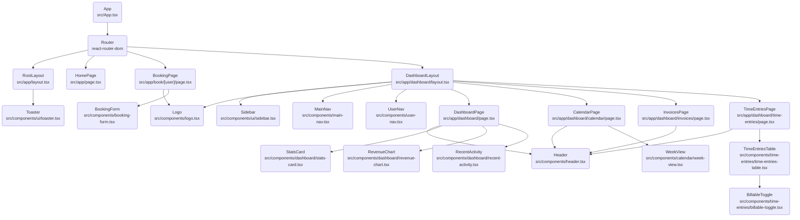

# Firebase Studio Starter (Vite Edition)

이 프로젝트는 **Firebase Genkit**과 **Vite (React)**를 활용하여 AI 기반 웹 애플리케이션을 빠르게 구축하기 위한 스타터 템플릿입니다.
모던한 UI를 위해 **Tailwind CSS**와 **Shadcn UI**가 적용되어 있습니다.

## ✨ 주요 기능 (Features)

- **Framework**: [Vite](https://vitejs.dev/) + [React](https://react.dev/)
- **Routing**: [React Router](https://reactrouter.com/)
- **AI Integration**: [Firebase Genkit](https://firebase.google.com/docs/genkit) (Google GenAI 연동 - Node.js 백엔드 필요)
- **Styling**: [Tailwind CSS](https://tailwindcss.com/)
- **UI Components**: [Shadcn UI](https://ui.shadcn.com/) (Radix UI 기반)
- **Form & Validation**: React Hook Form + Zod
- **Charts**: Recharts

## 📂 프로젝트 구조 (Project Structure)

```bash
src/
├── ai/               # Genkit 관련 AI 로직 (서버 사이드용)
├── app/              # 페이지 컴포넌트 (기존 Next.js 구조 유지)
│   ├── dashboard/    # 대시보드 관련 페이지
│   └── ...
├── components/       # UI 컴포넌트
│   ├── ui/           # Shadcn UI 기본 컴포넌트 (Button, Input 등)
│   └── ...           # 비즈니스 로직 관련 컴포넌트
├── lib/              # 유틸리티 함수 및 타입 정의
├── hooks/            # 커스텀 React Hooks
├── App.tsx           # 메인 라우팅 설정
└── main.tsx          # 앱 진입점
```

## 🚀 시작하기 (Getting Started)

로컬 개발 환경을 설정하고 프로젝트를 실행하는 방법입니다.

### 전제 조건 (Prerequisites)

- **Node.js**: v20 이상 권장
- **npm** 또는 **yarn**, **pnpm**

### 설치 (Installation)

1. 레포지토리를 클론합니다.
2. 의존성 패키지를 설치합니다.

```bash
npm install
# 또는
yarn install
```

### 환경 변수 설정 (Environment Variables)

Genkit 실행을 위해 `.env` 파일 설정이 필요합니다.

### 개발 서버 실행 (Development)

Vite 개발 서버를 실행합니다.

```bash
npm run dev
```

브라우저에서 [http://localhost:5173](http://localhost:5173)를 열어 확인하세요.

### Genkit 개발 도구 실행 (Genkit UI)

Genkit의 흐름(Flow)을 테스트하고 디버깅할 수 있는 개발자 UI를 실행합니다. (백엔드 로직 테스트용)

```bash
npm run genkit:dev
```

## 📑 프로젝트 문서 (Project Documentation)

*   **[사용자 워크플로우 (User Workflow)](docs/USER_WORKFLOW.md)**: 핵심 사용자 시나리오 정의
*   **[컴포넌트 구조 (Component Architecture)](docs/COMPONENT_ARCHITECTURE.md)**: 컴포넌트 계층 및 구조 분석
*   **[코드 품질 평가 (Code Quality Assessment)](docs/CODE_QUALITY_ASSESSMENT.md)**: 가독성, 재사용성 등 코드 품질 평가 결과

## 🌳 컴포넌트 트리 (Component Tree)



![Component Tree](https://mermaid.ink/img/Zmxvd2NoYXJ0IFRECiAgICBBcHAoIkFwcDxici8+c3JjL0FwcC50c3giKQogICAgUm91dGVyKCJSb3V0ZXI8YnIvPnJlYWN0LXJvdXRlci1kb20iKQogICAgUm9vdExheW91dCgiUm9vdExheW91dDxici8+c3JjL2FwcC9sYXlvdXQudHN4IikKICAgIFRvYXN0ZXIoIlRvYXN0ZXI8YnIvPnNyYy9jb21wb25lbnRzL3VpL3RvYXN0ZXIudHN4IikKICAgIAogICAgJSUgUm91dGVzCiAgICBIb21lUGFnZSgiSG9tZVBhZ2U8YnIvPnNyYy9hcHAvcGFnZS50c3giKQogICAgQm9va2luZ1BhZ2UoIkJvb2tpbmdQYWdlPGJyLz5zcmMvYXBwL2Jvb2svW3VzZXJdL3BhZ2UudHN4IikKICAgIERhc2hib2FyZExheW91dCgiRGFzaGJvYXJkTGF5b3V0PGJyLz5zcmMvYXBwL2Rhc2hib2FyZC9sYXlvdXQudHN4IikKICAgIAogICAgJSUgQm9va2luZyBQYWdlIENoaWxkcmVuCiAgICBMb2dvKCJMb2dvPGJyLz5zcmMvY29tcG9uZW50cy9sb2dvLnRzeCIpCiAgICBCb29raW5Gb3JtKCJCb29raW5Gb3JtPGJyLz5zcmMvY29tcG9uZW50cy9ib29raW5nLWZvcm0udHN4IikKCiAgICAlJSBEYXNoYm9hcmQgTGF5b3V0IENoaWxkcmVuCiAgICBTaWRlYmFyKCJTaWRlYmFyPGJyLz5zcmMvY29tcG9uZW50cy91aS9zaWRlYmFyLnRzeCIpCiAgICBNYWluTmF2KCJNYWluTmF2PGJyLz5zcmMvY29tcG9uZW50cy9tYWluLW5hdi50c3giKQogICAgVXNlck5hdigiVXNlck5hdjxici8+c3JjL2NvbXBvbmVudHMvdXNlci1uYXYudHN4IikKICAgIAogICAgJSUgRGFzaGJvYXJkIFBhZ2VzCiAgICBEYXNoYm9hcmRQYWdlKCJEYXNoYm9hcmRQYWdlPGJyLz5zcmMvYXBwL2Rhc2hib2FyZC9wYWdlLnRzeCIpCiAgICBDYWxlbmRhclBhZ2UoIkNhbGVuZGFyUGFnZTxici8+c3JjL2FwcC9kYXNoYm9hcmQvY2FsZW5kYXIvcGFnZS50c3giKQogICAgSW52b2ljZXNQYWdlKCJJbnZvaWNlc1BhZ2U8YnIvPnNyYy9hcHAvZGFzaGJvYXJkL2ludm9pY2VzL3BhZ2UudHN4IikKICAgIFRpbWVFbnRyaWVzUGFnZSgiVGltZUVudHJpZXNQYWdlPGJyLz5zcmMvYXBwL2Rhc2hib2FyZC90aW1lLWVudHJpZXMvcGFnZS50c3giKQoKICAgICUlIENvbXBvbmVudHMKICAgIEhlYWRlcigiSGVhZGVyPGJyLz5zcmMvY29tcG9uZW50cy9oZWFkZXIudHN4IikKICAgIFN0YXRzQ2FyZCgiU3RhdHNDYXJkPGJyLz5zcmMvY29tcG9uZW50cy9kYXNoYm9hcmQvc3RhdHMtY2FyZC50c3giKQogICAgUmV2ZW51ZUNoYXJ0KCJSZXZlbnVlQ2hhcnQ8YnIvPnNyYy9jb21wb25lbnRzL2Rhc2hib2FyZC9yZXZlbnVlLWNoYXJ0LnRzeCIpCiAgICBSZWNlbnRBY3Rpdml0eSgiUmVjZW50QWN0aXZpdHk8YnIvPnNyYy9jb21wb25lbnRzL2Rhc2hib2FyZC9yZWNlbnQtYWN0aXZpdHkudHN4IikKICAgIFdlZWtWaWV3KCJXZWVrVmlldzxici8+c3JjL2NvbXBvbmVudHMvY2FsZW5kYXIvd2Vlay12aWV3LnRzeCIpCiAgICBUaW1lRW50cmllc1RhYmxlKCJUaW1lRW50cmllc1RhYmxlPGJyLz5zcmMvY29tcG9uZW50cy90aW1lLWVudHJpZXMvdGltZS1lbnRyaWVzLXRhYmxlLnRzeCIpCiAgICBCaWxsYWJsZVRvZ2dsZSgiQmlsbGFibGVUb2dnbGU8YnIvPnNyYy9jb21wb25lbnRzL3RpbWUtZW50cmllcy9iaWxsYWJsZS10b2dnbGUudHN4IikKCiAgICAlJSBDb25uZWN0aW9ucwogICAgQXBwIC0tPiBSb3V0ZXIKICAgIFJvdXRlciAtLT4gUm9vdExheW91dAogICAgUm9vdExheW91dCAtLT4gVG9hc3RlcgogICAgCiAgICBSb3V0ZXIgLS0+IEhvbWVQYWdlCiAgICBSb3V0ZXIgLS0+IEJvb2tpbmdQYWdlCiAgICBSb3V0ZXIgLS0+IERhc2hib2FyZExheW91dAogICAgCiAgICBCb29raW5nUGFnZSAtLT4gTG9nbwogICAgQm9va2luZ1BhZ2UgLS0+IEJvb2tpbmdGb3JtCgogICAgRGFzaGJvYXJkTGF5b3V0IC0tPiBTaWRlYmFyCiAgICBEYXNoYm9hcmRMYXlvdXQgLS0+IExvZ28KICAgIERhc2hib2FyZExheW91dCAtLT4gTWFpbk5hdgogICAgRGFzaGJvYXJkTGF5b3V0IC0tPiBVc2VyTmF2CiAgICBEYXNoYm9hcmRMYXlvdXQgLS0+IERhc2hib2FyZFBhZ2UKICAgIERhc2hib2FyZExheW91dCAtLT4gQ2FsZW5kYXJQYWdlCiAgICBEYXNoYm9hcmRMYXlvdXQgLS0+ IEludm9pY2VzUGFnZQogICAgRGFzaGJvYXJkTGF5b3V0IC0tPiBUaW1lRW50cmllc1BhZ2UKCiAgICBEYXNoYm9hcmRQYWdlIC0tPiBIZWFkZXIKICAgIERhc2hib2FyZFBhZ2UgLS0+IFN0YXRzQ2FyZAogICAgRGFzaGJvYXJkUGFnZSAtLT4gUmV2ZW51ZUNoYXJ0CiAgICBEYXNoYm9hcmRQYWdlIC0tPiBSZWNlbnRBY3Rpdml0eQoKICAgIENhbGVuZGFyUGFnZSAtLT4gSGVhZGVyCiAgICBDYWxlbmRhclBhZ2UgLS0+IFdlZWtWaWV3CgogICAgSW52b2ljZXNQYWdlIC0tPiBIZWFkZXIKCiAgICBUaW1lRW50cmllc1BhZ2UgLS0+IEhlYWRlcgogICAgVGltZUVudHJpZXNQYWdlIC0tPiBUaW1lRW50cmllc1RhYmxlCgogICAgVGltZUVudHJpZXNUYWJsZSAtLT4gQmlsbGFibGVUb2dnbGU=)

---

Happy Coding! 🚀
