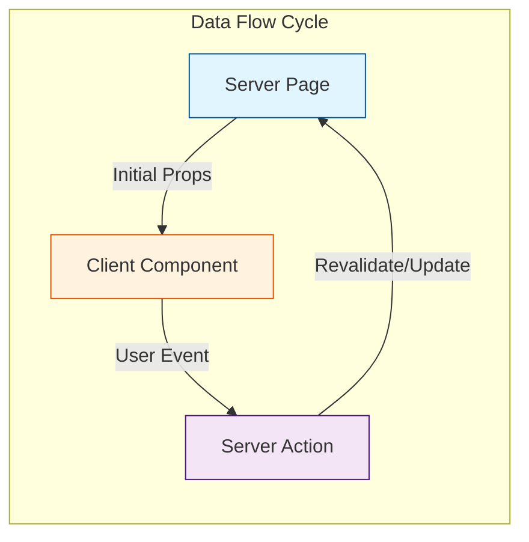
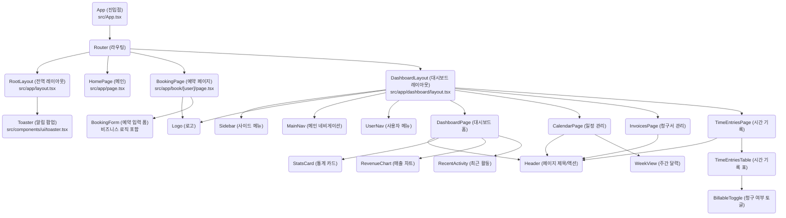
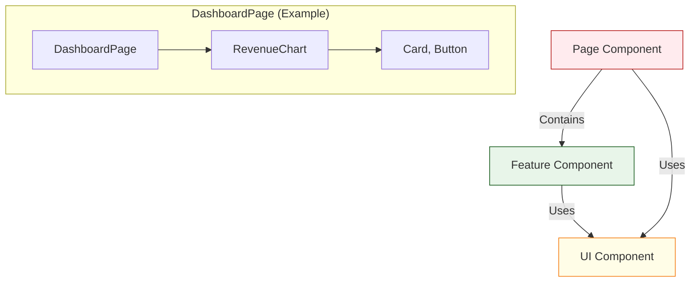
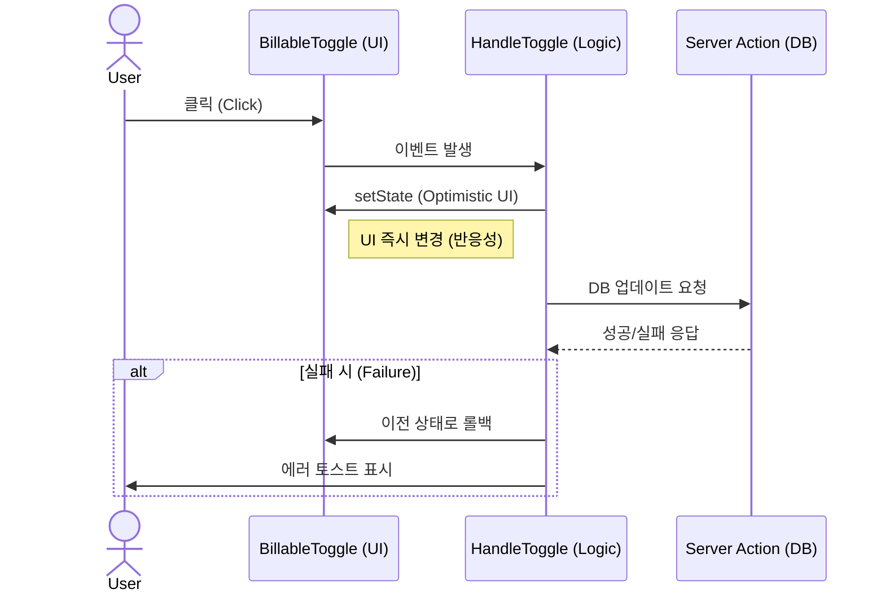

# 컴포넌트 아키텍처 및 구조 분석 (Component Architecture)

이 문서는 애플리케이션의 컴포넌트 구조, 데이터 흐름, 그리고 설계 원칙을 설명합니다.

## 1. 아키텍처 개요 (Architecture Overview)

이 프로젝트는 **Next.js App Router**를 기반으로 하며, 기능 중심의 계층화된 아키텍처를 따릅니다.

### 1-1. 레이어 구조 (Layer Structure)

애플리케이션은 역할과 책임에 따라 다음과 같은 레이어로 구분됩니다.

| 레이어 (Layer) | 설명 | 주요 경로 |
| :--- | :--- | :--- |
| **Page Layer** | 라우팅 및 페이지의 전체 레이아웃을 구성합니다. 데이터를 가져오거나 메타데이터를 정의합니다. | `src/app/**/page.tsx`, `layout.tsx` |
| **Feature Layer** | 특정 도메인(예: 송장, 예약)에 종속된 비즈니스 로직과 복잡한 UI를 담당합니다. | `src/components/dashboard/`, `src/components/calendar/` |
| **UI Layer** | 도메인과 무관한 순수 디자인 컴포넌트입니다. (Atomic Components) | `src/components/ui/` |
| **Service/Data Layer** | 데이터 정의, 유틸리티, 서버 액션 등을 포함합니다. | `src/lib/`, `src/app/actions.ts` |
| **AI Layer** | Genkit 등을 활용한 AI 관련 로직을 처리합니다. | `src/ai/` |

### 1-2. 데이터 흐름 (Data Flow)

데이터는 기본적으로 **단방향(Top-down)** 흐름을 원칙으로 하며, 사용자 인터랙션은 Server Action을 통해 처리됩니다.

1.  **Server -> Client**: `Page` 컴포넌트(Server Component)에서 초기 데이터를 로드하여 하위 `Feature` 및 `UI` 컴포넌트(Client Component)로 Props를 통해 전달합니다.
2.  **Client -> Server**: 사용자 상호작용(클릭, 입력)은 이벤트 핸들러를 통해 처리되며, 데이터 변경이 필요한 경우 **Server Actions**(`src/app/actions.ts`)를 호출합니다.
3.  **AI Integration**: AI 기능은 별도의 API 라우트나 Genkit flow를 통해 호출되며 비동기적으로 결과를 반환합니다.

---

## 2. 컴포넌트 구조도 (Component Tree)

애플리케이션의 전체적인 컴포넌트 계층 구조입니다.

---

## 3. 컴포넌트 분류 (Component Classification)

프로젝트 내 컴포넌트는 역할에 따라 계층적으로 구성됩니다.

### A. UI 컴포넌트 (Presentational)
*   **위치**: `src/components/ui/`
*   **특징**:
    *   데이터 로직이 없으며, 오직 `props`로 받은 데이터를 렌더링합니다.
    *   재사용성이 가장 높습니다. (Shadcn UI 기반)
    *   예: `Button`, `Input`, `Card`, `Table`

### B. 기능 컴포넌트 (Feature/Container)
*   **위치**: `src/components/{feature-name}/` (예: `dashboard`, `calendar`)
*   **특징**:
    *   특정 비즈니스 로직을 포함하거나 상태(`useState`, `useEffect`)를 관리합니다.
    *   UI 컴포넌트를 조합하여 의미 있는 기능을 수행합니다.
    *   예: `BookingForm` (폼 유효성 검사 및 제출), `RevenueChart` (데이터 시각화 로직)

### C. 페이지 컴포넌트 (Page)
*   **위치**: `src/app/**/page.tsx`
*   **특징**:
    *   라우트에 대응하는 최상위 컨테이너입니다.
    *   서버 사이드 데이터 페칭을 담당하고 레이아웃을 결정합니다.
    *   예: `DashboardPage`

---

## 4. 상태 관리 및 이벤트 흐름 (State Management)

### 4-1. 상태 관리 전략
현재 애플리케이션은 **Local State**와 **Server State**를 혼합하여 사용합니다.

### 4-2. 이벤트 발생 시 흐름 예시 (청구 가능 여부 토글)

사용자 액션이 발생했을 때의 처리 과정(Sequence)입니다.

1.  **Event**: 사용자가 `BillableToggle` 스위치 클릭
2.  **Handle**: 컴포넌트 내부 `handleToggle` 실행
3.  **Update**: `useState`를 통해 로컬 UI 즉시 반영 (Optimistic UI 패턴 고려 가능)
4.  **Action**: (구현 시) Server Action을 호출하여 DB 업데이트 요청
5.  **Re-render**: 부모 컴포넌트가 새로운 데이터를 받아오거나 상태 변경을 감지하여 UI 갱신

---

## 5. 현황 분석 및 개선 제안

### 5-1. 현황
*   **모듈화 수준**: UI 컴포넌트(`src/components/ui`)는 잘 분리되어 있으나, 일부 페이지(`page.tsx`)에 비즈니스 로직이 혼재될 가능성이 있습니다.
*   **관심사 분리**: 프레젠테이션과 로직의 분리가 대체로 잘 되어 있습니다.

### 5-2. 개선 제안
1.  **공통 레이아웃 패턴화**: 반복되는 Header/Main 구조를 `PageContainer`로 추상화.
2.  **데이터 테이블 추상화**: `DataTable` 도입으로 반복되는 테이블 로직 제거.
3.  **전역 상태 도입 고려**: 사용자 세션, 테마, 전역 알림 등을 위한 Context API 또는 Zustand 도입 검토.
4.  **Service Layer 강화**: Mock Data를 실제 API 호출로 대체하기 위한 인터페이스 정의 필요.
