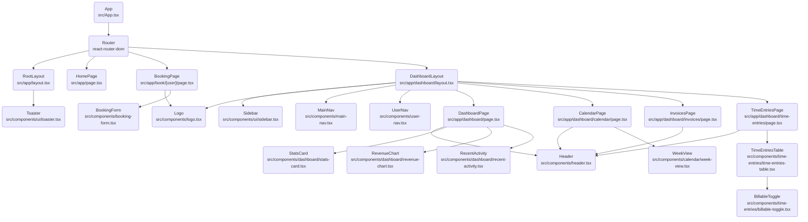

# 컴포넌트 구조 및 개선점 분석 (Component Architecture)

## 1. 컴포넌트 구조도 (Component Tree)

애플리케이션의 현재 컴포넌트 계층 구조입니다.

## 2. 현황 분석

*   **모듈화 수준**: UI 컴포넌트(`src/components/ui`)는 Shadcn UI를 기반으로 잘 모듈화되어 있어 재사용성이 높습니다.
*   **레이아웃 분리**: `RootLayout`과 `DashboardLayout`으로 레이아웃이 명확히 분리되어 있어, 페이지별로 필요한 구조(예: 대시보드의 사이드바)를 효율적으로 관리하고 있습니다.
*   **관심사 분리**: 비즈니스 로직(예: `BookingForm`, `BillableToggle`)과 프레젠테이션 로직(예: `StatsCard`, `RevenueChart`)이 적절히 분리되어 있습니다.

## 3. 개선 제안

1.  **공통 레이아웃 패턴화**:
    *   현재 각 대시보드 하위 페이지(`DashboardPage`, `CalendarPage` 등)에서 `Header` 컴포넌트와 `main` 태그 구조가 반복되고 있습니다.
    *   **제안**: `PageContainer`와 같은 래퍼 컴포넌트를 만들어 반복되는 레이아웃 코드를 줄일 수 있습니다.

2.  **데이터 테이블 추상화**:
    *   `InvoicesPage`와 `TimeEntriesPage`에서 테이블 렌더링 로직이 유사합니다.
    *   **제안**: `DataTable` 컴포넌트를 도입하여 데이터와 컬럼 정의만 주입받아 렌더링하도록 리팩토링하면 유지보수성이 향상됩니다.

3.  **상태 관리**:
    *   현재는 로컬 상태(`useState`) 위주로 관리되고 있습니다. 앱 규모가 커질 경우 전역 상태 관리(Context API, Redux, Zustand 등) 도입을 고려해야 합니다. (특히 사용자 정보, 알림 등)

4.  **하드코딩 데이터 제거**:
    *   `mockData`를 사용하고 있는 부분들을 API 호출 구조로 전환하기 위한 서비스 레이어(Service Layer) 도입이 필요합니다.

